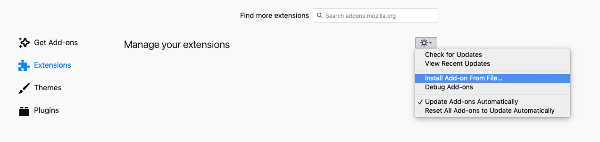

# I am coming from google firefox extension

Adds a refereal header with the value `https://google.com` for specified domains.

The addon also clears all cookies and localstorage for the provided domains for every request.

## Usage

The addon adds a button to the toolbar, when clicked the domain you are currently on is added to the list of domains the extension will operate on.

A domain is in the list if the toolbar icon looks like the following


A domain is __NOT__ in the list if the toolbar icon looks like the following


You might have to reload a page sometimes for the extension to work properly.

## Installation

Go to [the releases page](https://github.com/nattvara/i-am-coming-from-google/releases) and click on the link to `i_am_coming_from_google-1.0-fx.xpi` under the assets of the latest version.

Allow firefox to install the addon.

If this does not work, see the alternative installation below.

### Alternative installation

Download the latest binary (`i_am_coming_from_google-1.0-fx.xpi`) from [the releases page](https://github.com/nattvara/i-am-coming-from-google/releases)

Open the extensions page in firefox via the link in the lower left in the preferences page, or type `about:addons` in the address bar.

Click `Install Add-on From File...` and navigate to where you downloaded `i_am_coming_from_google-1.0-fx.xpi`



## Build

From the repository root

```bash
cd src && zip -r -FS ../build/i-am-coming-from-google.xpi * && cd ..
```
